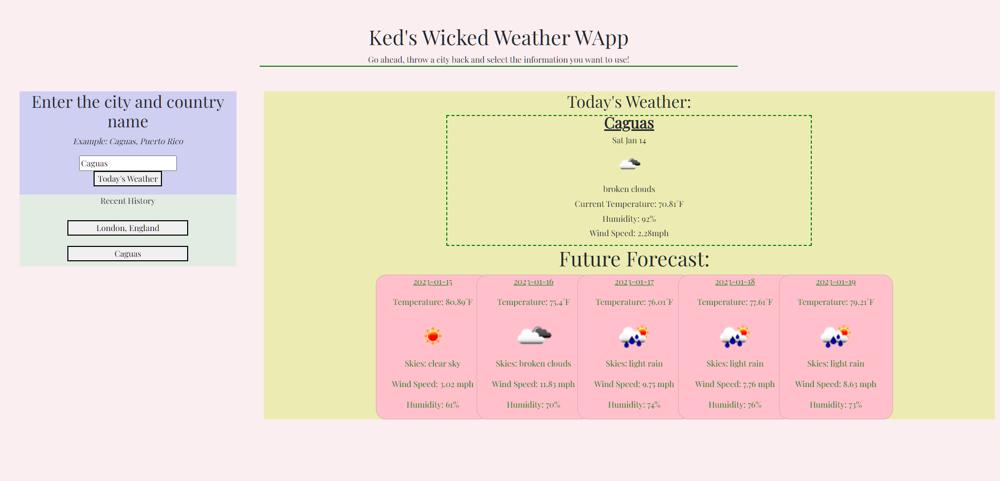

### Licenses
* License Badge: 
* Link for license Badge: https://opensource.org/licenses/MIT

# Ked's Weather App

## What is this project?
This project is a weather dashboard that shows the user certain aspects of the weather in any city of their choosing. I used 
Weather API - OpenWeatherMap as the API, and bootstrap for the design. Their history is stored in local storage as well.

### Contribution
Feel free to fork the repo and add anything you think would make the project better!

[Live Site](https://kenny4297.github.io/Weather-App-API/)
